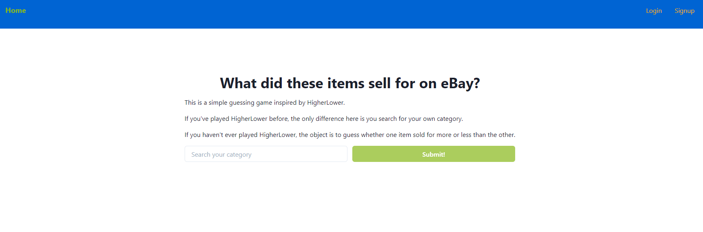
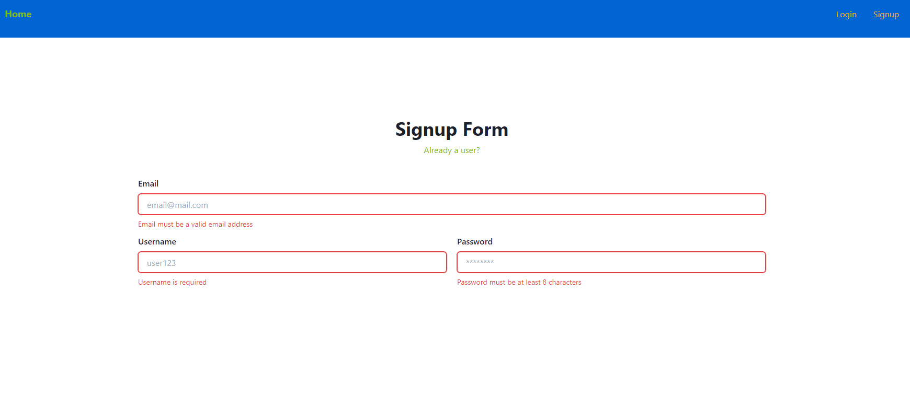
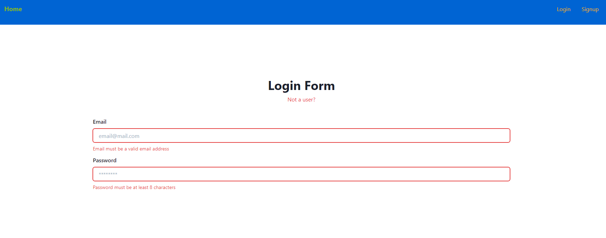
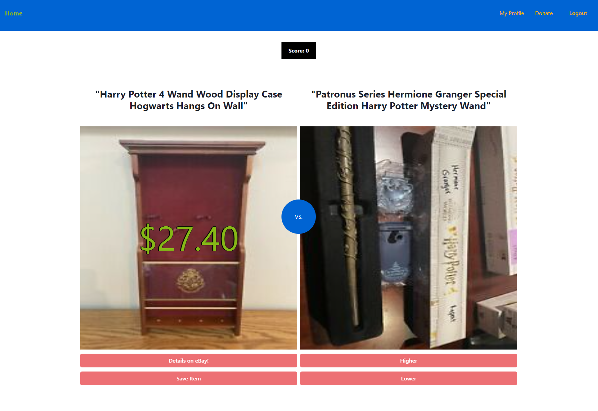
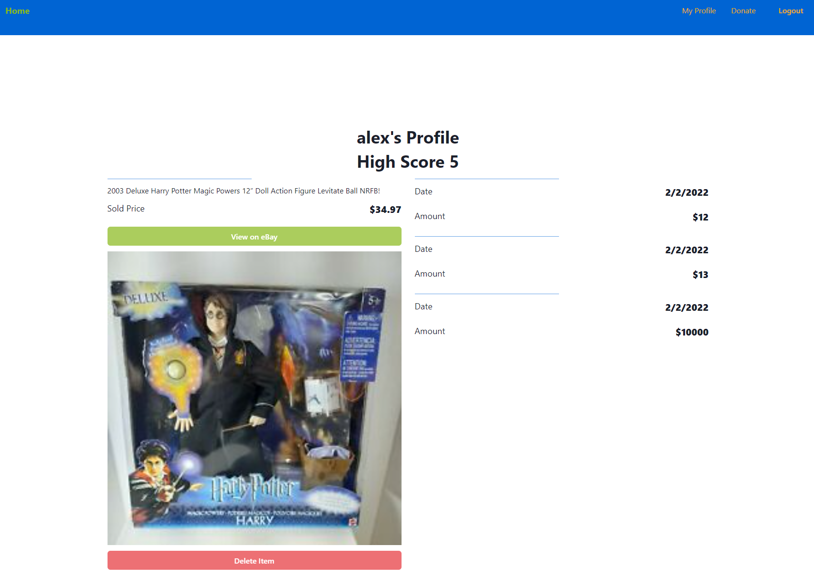
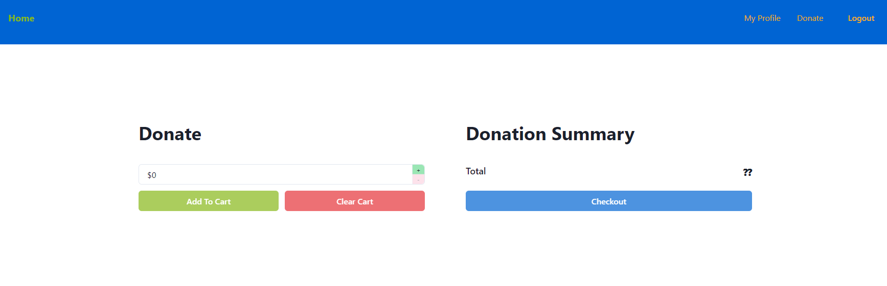

[](https://opensource.org/licenses/MIT)

# Sold On Ebay

## Description

This application is a simple but addictive guessing game that uses real sales data from ebay. Taking inspiration from the game HigherLower, a user must guess whether one item sold for more or less than the other. After each game, if you are logged in it gives you the option to save your score. In addition to the game, a user can save an item to their profile if it stands out to them.

The application also supports users donating if they choose so via stripe (currently the test API).

## Deployed Application

https://sold-on-ebay.herokuapp.com/

## Table of Contents

* [Screenshots](#screenshots)
* [Installation](#installation)
* [Usage](#usage)
* [Tech Stack](#tech-stack)
* [License](#license)
* [Questions](#questions)

## Screenshots













## Installation

There are a few different steps to getting this application installed and ready to go on your local machine.

Step 1: Install MongoDB if you haven't already. Please refer to online documents to get MongoDB up and running (MongoDB Official Installation Walkthroughs for Windows/Mac/Linux)

Step 2: Clone this repo onto your local machine.

Step 3: Navigate to this project's root directory in your terminal and run the following installation command

```
npm install
```


## Usage

Continuing from the installation instructions, the following steps will help you use this application.

Step 4: After installing all dependencies, you may invoke the application using:

```
npm run develop
```

This will open the front end and back end concurrently (client, server).

Step 5: Navigate to localhost:3000 in order to view the application locally.

Step 6: Navigate to localhost:3001/graphql in order to access the back end through GraphQL and test queries and mutations

(Note: you will need your own API key in order to use this application locally)

## Tech Stack

- MongoDB
- Mongoose ODM
- Express.js
- React
- React-Router-Dom
- React-Scripts
- React-Boostrap
- Redux
- Node.js
- Apollo Client
- Apollo-Server-Express
- GraphQL
- Nodemon
- JSON Web Tokens
- Chakra UI
- Anime.js
- Stripe

## License

Copyright 2022 Alex Sadrgilany

Permission is hereby granted, free of charge, to any person obtaining a copy 
of this software and associated documentation files (the "Software"), to deal 
in the Software without restriction, including without limitation the rights to 
use, copy, modify, merge, publish, distribute, sublicense, and/or sell copies of the 
Software, and to permit persons to whom the Software is furnished to do so, 
subject to the following conditions:

The above copyright notice and this permission notice shall be included in all 
copies or substantial portions of the Software.

THE SOFTWARE IS PROVIDED "AS IS", WITHOUT WARRANTY OF ANY KIND, EXPRESS OR IMPLIED, 
INCLUDING BUT NOT LIMITED TO THE WARRANTIES OF MERCHANTABILITY, FITNESS FOR A 
PARTICULAR PURPOSE AND NONINFRINGEMENT. IN NO EVENT SHALL THE AUTHORS OR COPYRIGHT 
HOLDERS BE LIABLE FOR ANY CLAIM, DAMAGES OR OTHER LIABILITY, WHETHER IN AN ACTION OF 
CONTRACT, TORT OR OTHERWISE, ARISING FROM, OUT OF OR IN CONNECTION WITH THE SOFTWARE 
OR THE USE OR OTHER DEALINGS IN THE SOFTWARE.

## Questions

[My GitHub Profile](https://github.com/asadg7)

To reach me with questions, please email: asadrgilany7@gmail.com